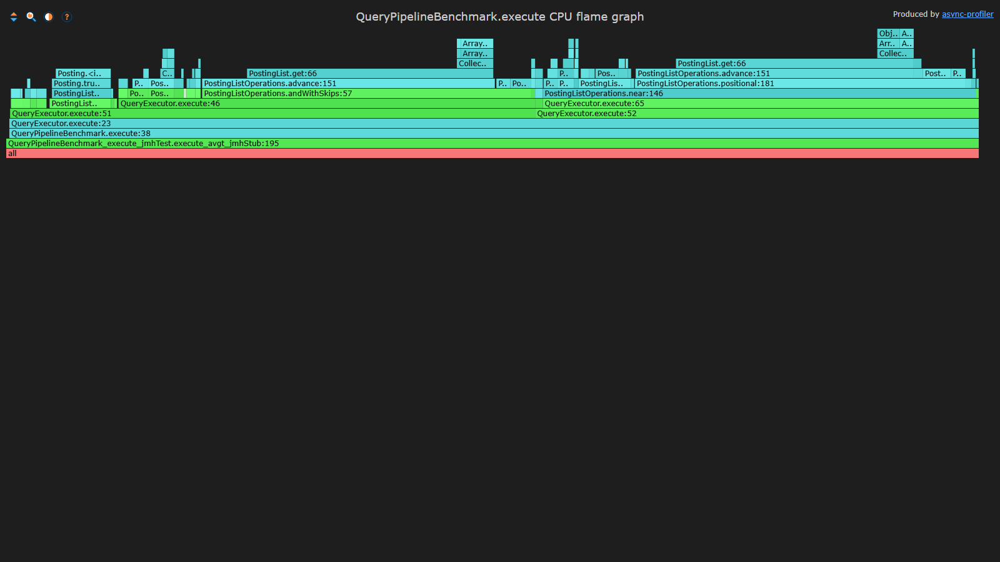
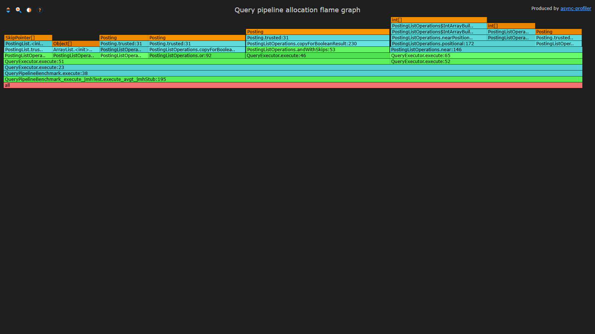
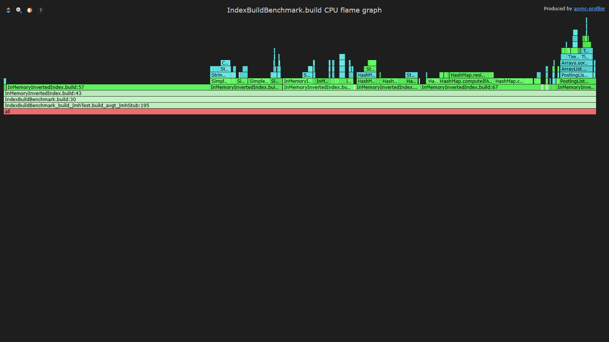
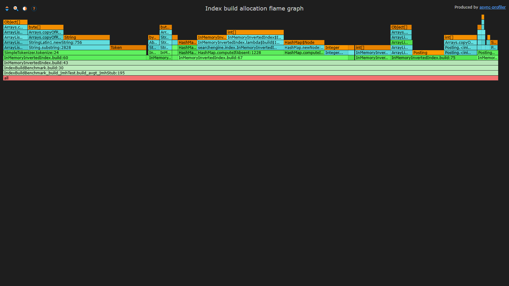

# Отчёт по лабораторной работе №5

**Дисциплина:** Структуры и алгоритмы в базах данных и распределённых системах  
**Тема:** Поисковая система на координатном обратном индексе  
**Выполнил:** Постнов С. А., P4135  
**Преподаватели:** Платонов А. В., доцент; Портнов П. В., ассистент  
**Дата актуализации:** 13 июня 2026 года

## Содержание

1. [Цель и результат работы](#цель-и-результат-работы)
2. [Архитектура](#архитектура)
3. [Координатный обратный индекс](#координатный-обратный-индекс)
4. [Дисковый формат](#дисковый-формат)
5. [Язык и исполнение запросов](#язык-и-исполнение-запросов)
6. [Skip lists](#skip-lists)
7. [Сжатие](#сжатие)
8. [Ранжирование BM25](#ранжирование-bm25)
9. [Методика бенчмарков](#методика-бенчмарков)
10. [Результаты бенчмарков](#результаты-бенчмарков)
11. [Реальная коллекция](#реальная-коллекция)
12. [Контрольные запросы и тесты](#контрольные-запросы-и-тесты)
13. [CLI и ручная проверка](#cli-и-ручная-проверка)
14. [Веб-интерфейс](#веб-интерфейс)
15. [Профилирование](#профилирование)
16. [Инструкции запуска](#инструкции-запуска)
17. [Ограничения](#ограничения)
18. [Вывод](#вывод)

## Цель и результат работы

Цель лабораторной работы — реализовать поисковую систему на основе
координатного обратного индекса с поддержкой:

- хранения `docID`, term frequency и позиций термов;
- булевых и позиционных операторов;
- дерева запросов и вложенных выражений;
- skip lists;
- дискового хранения и ленивого чтения posting lists;
- нескольких методов сжатия;
- ранжирования BM25;
- веб-доступа к поиску и исходным документам;
- воспроизводимых JMH-бенчмарков;
- проверки результата на реальной коллекции документов;
- CPU- и allocation-профилирования.

Проект реализован на Java 11. Итоговая система поддерживает все перечисленные
возможности, работает на первых 100 000 страницах русской Wikipedia и имеет CLI
и веб-интерфейс для ручной проверки найденных документов и позиций.

## Архитектура

Основные компоненты проекта:

| Пакет | Назначение |
| --- | --- |
| `document` | потоковые загрузчики TXT, BEIR JSONL и MediaWiki XML |
| `tokenizer` | lowercase-нормализация и назначение последовательных позиций токенам |
| `index` | координатный индекс, posting lists, skip pointers и операции над списками |
| `query` | ANTLR-грамматика, AST, in-memory и streaming executors |
| `storage` | бинарный writer, `FileChannel` reader и paged mmap reader |
| `compression` | raw, delta, varbyte, bitpacking и patched bitpacking |
| `ranking` | BM25 и модель результата поиска |
| `web` | HTTP API и браузерный интерфейс поиска |
| `benchmark` | JMH для build, load, parse, execute, rank, read и compression |

Путь обработки данных:

1. `DocumentLoader` лениво возвращает документы.
2. `SimpleTokenizer` нормализует текст и создаёт токены с позициями.
3. `InMemoryInvertedIndex` строит posting lists.
4. `DiskIndexWriter` сохраняет индекс с выбранным кодеком.
5. `MMapIndexReader` или `DiskIndexReader` открывает индекс.
6. `AntlrQueryParser` строит AST.
7. `StreamingQueryExecutor` выполняет запрос через курсоры.
8. `DiskBM25Scorer` при необходимости ранжирует найденные документы.

## Координатный обратный индекс

Обратный индекс отображает терм в упорядоченный список документов, где этот
терм встречается.

Posting имеет логическую структуру:

```text
(docID, termFrequency, [position1, position2, ...])
```

Для каждого posting хранятся:

- `docID`;
- term frequency;
- отсортированный массив позиций терма в документе.

Posting list сортируется по `docID`. Для терма можно получить:

- полный posting list с позициями;
- список `docID` и TF без позиций;
- потоковый `PostingCursor`, который декодирует текущий posting по мере чтения.

Индекс проверен не только на синтетических данных, но и на реальном дампе
Wikipedia.

При построении использованы:

- `HashMap` вместо per-term `TreeMap`;
- примитивные расширяемые массивы позиций вместо boxed `List<Integer>`;
- однопроходное построение snippet без регулярных выражений.

Эти изменения устранили ранее возникавший `OutOfMemoryError` на 100 000
документов.

## Дисковый формат

Текущая версия формата — v4.

| Файл | Содержимое |
| --- | --- |
| `dictionary.bin` | term, document frequency, offsets и lengths; блок сжат deflate |
| `postings.bin` | потоки docID и TF, persistent skip offsets |
| `positions.bin` | позиции каждого терма внутри документа |
| `documents.bin` | docID, внешний ID, длина и snippet до 500 символов; deflate |
| `meta.json` | версия, кодеки, размеры и статистика |

По умолчанию используются:

- docID: delta + varbyte;
- positions: delta внутри каждого документа + varbyte;
- term frequency: varbyte без delta;
- dictionary и document metadata: deflate.

TF не кодируется через delta, поскольку значения не образуют
неубывающую последовательность. Delta позиций сбрасывается на границе каждого
документа.

Reader загружает dictionary и document metadata, но не загружает posting lists
целиком. Старые индексы v1–v3 читаются в режиме совместимости.

### Paged mmap

`MMapIndexReader` использует `PagedMMapFile`:

- размер страницы по умолчанию — 64 KiB;
- страницы отображаются только при обращении;
- число отображённых страниц ограничивается LRU cache;
- slice внутри одной страницы не копируется;
- при пересечении границы страниц копируются только байты запрошенного slice.

Первый запрос может включать page faults и быть медленнее. Повторные обращения
используют page cache операционной системы и LRU отображённых страниц.

## Язык и исполнение запросов

Поддерживаемые операторы:

- `A AND B`;
- `A OR B`;
- `NOT expression`;
- `A ADJ B`;
- `A EDGE B`, синоним `ADJ`;
- `A NEAR/k B`;
- скобки и произвольные комбинации.

Примеры поддерживаемых выражений:

```text
A AND B
A OR B
A AND NOT B
NOT (A ADJ B)
A AND NOT (B ADJ C)
A AND NOT (B NEAR/1 C)
(A OR B) ADJ C
A ADJ (B ADJ C)
```

Приоритеты операторов:

1. скобки;
2. `ADJ`, `EDGE`, `NEAR/k`;
3. unary `NOT`;
4. `AND`;
5. `OR`.

Парсер реализован через ANTLR. При ошибке возвращается сообщение с номером
строки, позицией и описанием синтаксической ошибки.

### Дерево запроса

AST состоит из узлов:

- `TermNode`;
- `AndNode`;
- `OrNode`;
- `NotNode`;
- `AdjNode`;
- `NearNode`.

`NOT` является unary operator и принимает произвольное подвыражение.

Термы внутри `NOT` не включаются в набор positive terms и не влияют на BM25
score.

### AND

AND выполняется как пересечение двух отсортированных posting lists.

Используются:

- два курсора;
- `advanceTo` для перехода к целевому `docID`;
- skip pointers для списков с заметно различающимися размерами.

Для сопоставимых списков адаптивный алгоритм выбирает линейное пересечение,
поскольку skips в этом случае не дают выигрыша.

### OR

OR выполняется линейным слиянием отсортированных posting lists.

Пропуск элементов через skips для OR неприменим: все элементы обоих списков
должны попасть в результат. Результирующий список создаётся сразу в
отсортированном виде без дополнительной сортировки.

### NOT и AND NOT

Unary `NOT` строит дополнение результата подвыражения относительно множества
всех `docID`.

Выражения:

```text
A AND NOT B
A AND NOT (B ADJ C)
A AND NOT (B NEAR/1 C)
```

исполняются как difference через `AndNotCursor`, без материализации полного
дополнения правой части.

### ADJ и EDGE

`A ADJ B` возвращает документы, где позиция `B` равна позиции `A + 1`.
`EDGE` имеет ту же семантику.

Позиционные списки сравниваются двумя указателями без декартова произведения.
Результат хранит позиции правого края найденной последовательности, что
позволяет корректно вычислять цепочки:

```text
(A ADJ B) ADJ C
```

Право-вложенное выражение:

```text
A ADJ (B ADJ C)
```

нормализуется в эквивалентную левую цепочку.

### NEAR/k

`A NEAR/k B` возвращает документы, где:

```text
abs(positionA - positionB) <= k
```

Оператор симметричен. Сравнение позиций также выполняется двумя указателями.

### Позиции составных выражений

Если boolean-подвыражение является операндом `ADJ` или `NEAR`, позиции обеих
ветвей объединяются и сортируются без дубликатов. Например:

```text
(A OR B) ADJ C
(A AND B) ADJ C
```

Для обычного boolean-запроса объединение координат не выполняется, чтобы не
создавать лишние массивы в hot path.

## Skip lists

Для in-memory posting lists skip pointers строятся с шагом порядка
`sqrt(documentFrequency)`.

Для default-кодека `delta-varbyte` skip table сохраняется на диск. Каждый
элемент содержит:

- индекс posting;
- целевой `docID`;
- предыдущий `docID`;
- byte offset в docID stream;
- byte offset в TF stream;
- byte offset в position stream;
- число уже прочитанных position gaps.

`DiskPostingCursor.advanceTo` выполняет бинарный поиск подходящего skip entry,
переставляет состояния varbyte cursors на сохранённые offsets и продолжает
декодирование с найденной позиции.

Skips используются:

- в AND;
- в AND NOT/difference через `advanceTo`;
- при синхронизации документов в ADJ и NEAR;
- при потоковом BM25 scoring.

Для OR применяется линейное слияние, поскольку пропуск документов изменил бы
результат.

## Сжатие

Поддерживаются режимы:

```text
none
delta
varbyte
delta-varbyte
bitpacking
delta-bitpacking
pfor
delta-pfor
```

Реализации:

- `NoCompression` — 32-битные значения;
- `VarByteCompression` — variable byte;
- `BitPackingCompression` — общий bit width для массива;
- `PatchedBitPackingCompression` — блоки по 128 значений, 90-й перцентиль
  bit width и отдельное хранение исключений;
- delta-варианты предварительно преобразуют отсортированные docID или позиции
  в gaps.

`pfor` в проекте является учебной patched-bitpacking реализацией, а не
SIMD-библиотекой промышленного уровня.

### Размер индекса

Синтетическая коллекция содержит 10 000 документов по 80 токенов.

| Режим | Payload, bytes | Raw/payload | Полный индекс, bytes |
| --- | ---: | ---: | ---: |
| none | 8 209 548 | 0.994 | 9 467 069 |
| delta | 8 209 548 | 0.994 | 9 467 076 |
| varbyte | 2 676 901 | 3.048 | 3 935 329 |
| delta-varbyte | 2 084 521 | 3.915 | 4 753 236 |
| bitpacking | 1 938 169 | 4.210 | 3 195 213 |
| delta-bitpacking | 1 369 746 | 5.957 | 2 626 725 |
| pfor | 2 294 914 | 3.556 | 3 552 880 |
| delta-pfor | 1 643 321 | 4.966 | 2 902 354 |

Выводы:

- delta-bitpacking даёт минимальный размер полного индекса;
- `none` и `delta` имеют ratio меньше единицы из-за заголовка с числом
  элементов;
- delta без последующего кодека меняет значения, но не уменьшает их 32-битное
  представление;
- полный `delta-varbyte` индекс больше payload-оценки из-за persistent skip
  table;
- дополнительный размер `delta-varbyte` является обменом пространства на
  streaming `advanceTo`.

### Скорость кодирования docID

JMH для массива из 100 000 docID:

| Режим | Encode, us/op | Decode, us/op |
| --- | ---: | ---: |
| none | 45.724 | 90.619 |
| delta | 111.316 | 143.431 |
| varbyte | 426.903 | 384.175 |
| delta-varbyte | 241.430 | 300.927 |
| bitpacking | 352.082 | 324.582 |
| delta-bitpacking | 214.905 | 195.680 |
| pfor | 606.262 | 372.892 |
| delta-pfor | 602.382 | 294.027 |

`none` быстрее всех при изолированном декодировании. Среди сжатых вариантов
минимальное decode time у `delta-bitpacking`. End-to-end поиск измеряет
дополнительно чтение, создание объектов, streaming decode и skips, поэтому
его результаты не совпадают с этим микробенчмарком.

### Диагностический вывод

Compression report выводит:

- пример posting list;
- исходные docID;
- docID deltas;
- term frequencies;
- позиции одного документа;
- position deltas;
- размер docID, TF и position sample для каждого кодека.

Пример:

```text
docIds=[1, 2, 3, 4, ...]
docIdDeltas=[1, 1, 1, 1, ...]
termFrequencies=[16, 16, 16, 16, ...]
positions(docId=1)=[0, 5, 10, 15, ...]
positionDeltas=[0, 5, 5, 5, ...]
```

## Ранжирование BM25

Ранжирование реализовано через BM25:

```text
score(D, Q) =
    sum(
        IDF(t) * f(t,D) * (k1 + 1)
        / (f(t,D) + k1 * (1 - b + b * |D| / avgdl))
    )
```

где:

- `f(t,D)` — term frequency;
- `|D|` — длина документа;
- `avgdl` — средняя длина документа;
- `k1 = 1.2`;
- `b = 0.75`;
- `IDF(t) = log(1 + (N - n(t) + 0.5) / (n(t) + 0.5))`.

Ранжирование:

- можно включить или отключить;
- измеряется отдельно от поиска;
- выводит score;
- сортирует документы по убыванию score и затем по `docID`;
- использует bounded priority queue для top-K;
- не учитывает термы из отрицательных подвыражений.

## Методика бенчмарков

Используется JMH 1.37.

13 июня 2026 года все 23 benchmark-метода были запущены единым suite. С учётом
параметров кодеков, типов данных и размеров posting lists получено 114 JMH
results.

Единая конфигурация:

- 2 warmup iterations по 500 ms;
- 3 measurement iterations по 500 ms;
- 2 forks;
- 1 benchmark thread;
- average time mode;
- JDK 21.0.10;
- Windows 11.

Подготовка коллекций, временных индексов и readers выполняется на
`Level.Trial` и не входит в измеряемую операцию. Парсинг, исполнение AST,
ranking, build, write, load, posting read, search и compression измеряются
отдельно.

Полный прогон воспроизводится командой:

```powershell
.\profiling\run-all-benchmarks.ps1 -SkipBuild
```

Для pipeline отдельно выполнен такой же запуск с `-prof gc`. JFR-профили
записывались с одним 5-секундным warmup и четырьмя 5-секундными measurement
iterations.

### Сопоставимость операторов

Для всех бинарных операторов используются одни и те же posting list pairs:

- `rare-rare`;
- `rare-medium`;
- `rare-common`;
- `medium-medium`;
- `common-common`.

В каждой категории задаётся контролируемое пересечение. AND, OR, AND NOT, ADJ и
NEAR выполняются на одинаковых двух списках. Построение данных не входит в
benchmark invocation.

## Результаты бенчмарков

### Операторы

| Оператор, us/op | rare-rare | rare-medium | rare-common | medium-medium | common-common |
| --- | ---: | ---: | ---: | ---: | ---: |
| adaptive AND | 1.143 | 9.184 | 43.106 | 56.374 | 655.053 |
| AND без skips | 1.200 | 30.106 | 284.744 | 57.351 | 638.836 |
| OR | 2.386 | 63.482 | 511.434 | 89.499 | 883.744 |
| AND NOT | 1.510 | 6.357 | 62.375 | 63.751 | 673.158 |
| ADJ | 1.820 | 8.368 | 48.738 | 103.047 | 1241.904 |
| NEAR/3 | 2.125 | 9.646 | 45.047 | 102.554 | 1549.453 |

На skewed posting lists skips уменьшают latency AND:

- `rare-medium`: с 30.106 до 9.184 us/op, ускорение 3.28 раза;
- `rare-common`: с 284.744 до 43.106 us/op, ускорение 6.61 раза.

На сопоставимых списках skips не дают подтверждённого выигрыша: интервалы
`andWithSkips` и `andWithoutSkips` пересекаются. AND остаётся быстрее OR:

- `rare-common`: AND 43.106 us/op, OR 511.434 us/op;
- `common-common`: AND 655.053 us/op, OR 883.744 us/op.

### Query pipeline и allocation

| Этап | Время, us/op | Allocation, B/op |
| --- | ---: | ---: |
| parse | 3.522 | 7 152 |
| execute AST | 135.753 | 78 882 |
| BM25 rank | 552.107 | 719 112 |

Парсинг занимает около 2.6% времени execute AST. Ranking остаётся самым
дорогим этапом и выделяет примерно в 9.1 раза больше памяти, чем execute AST.

### Построение, загрузка и чтение

| Benchmark | Результат |
| --- | ---: |
| index build | 263.304 ms/op |
| disk index write | 305.041 ms/op |
| load disk reader | 34.783 ms/op |
| load mmap reader | 34.560 ms/op |
| in-memory posting lookup | 0.018 us/op |
| disk docID/TF read | 203.639 us/op |
| mmap docID/TF read | 183.925 us/op |
| disk full posting read | 1445.720 us/op |
| mmap full posting read | 1410.451 us/op |

DocID/TF-only чтение примерно в 7–8 раз быстрее полного posting read с
позициями. Разница между disk и mmap reader в прогретом synthetic workload
невелика; mmap быстрее для docID/TF-only чтения.

### Поиск с разными кодеками

| Режим | In-memory, us/op | Disk, us/op | mmap, us/op |
| --- | ---: | ---: | ---: |
| none | 809.487 | 3421.896 | 2899.787 |
| delta | 812.983 | 3529.433 | 2812.748 |
| varbyte | 890.358 | 2803.499 | 2593.057 |
| delta-varbyte | 803.324 | 1640.869 | 1913.504 |
| bitpacking | 774.460 | 3281.580 | 2897.485 |
| delta-bitpacking | 895.931 | 2641.591 | 2524.405 |
| pfor | 770.064 | 3348.945 | 3135.276 |
| delta-pfor | 798.938 | 2852.029 | 2731.878 |

`delta-varbyte` имеет лучшую end-to-end query latency, поскольку поддерживает
streaming decode и persistent skips. Это не означает, что varbyte-декодирование
само по себе быстрее несжатого: отдельный benchmark декодирования 100 000
docID даёт 300.927 us/op для `delta-varbyte` против 90.619 us/op для `none`.

Для остальных кодеков `openCursor` полностью материализует posting list в
объекты и использует `ListPostingCursor`. `delta-varbyte` использует
`DiskPostingCursor`, который:

- декодирует docID, TF и позиции по мере продвижения;
- не создаёт весь posting list заранее;
- выполняет `advanceTo` по byte offsets из persistent skip table;
- может не декодировать пропущенные участки длинных списков.

На этом workload `delta-varbyte` быстрее `none` в 2.09 раза для disk reader и
в 1.52 раза для mmap reader. Номинальная разница между disk и mmap для
`delta-varbyte` находится в пределах широких доверительных интервалов.

### Compression microbenchmarks

Время кодирования 100 000 значений:

| Режим | docID, us/op | TF, us/op | Position gaps, us/op |
| --- | ---: | ---: | ---: |
| none | 45.724 | 45.533 | 47.202 |
| delta | 111.316 | 43.636 | 44.329 |
| varbyte | 426.903 | 201.506 | 216.419 |
| delta-varbyte | 241.430 | 204.302 | 217.158 |
| bitpacking | 352.082 | 152.146 | 291.274 |
| delta-bitpacking | 214.905 | 156.309 | 305.675 |
| pfor | 606.262 | 571.283 | 688.656 |
| delta-pfor | 602.382 | 599.385 | 688.890 |

Время декодирования 100 000 значений:

| Режим | docID, us/op | TF, us/op | Position gaps, us/op |
| --- | ---: | ---: | ---: |
| none | 90.619 | 95.988 | 96.042 |
| delta | 143.431 | 95.734 | 95.255 |
| varbyte | 384.175 | 141.289 | 147.051 |
| delta-varbyte | 300.927 | 141.397 | 148.725 |
| bitpacking | 324.582 | 182.879 | 256.436 |
| delta-bitpacking | 195.680 | 178.617 | 258.415 |
| pfor | 372.892 | 236.703 | 266.957 |
| delta-pfor | 294.027 | 256.268 | 292.875 |

Текущие артефакты:

- `profiling/jmh-all-2026-06-13.json` — все 114 JMH results;
- `profiling/jmh-query-pipeline-gc-2026-06-13.json` — время и allocation
  pipeline;
- `target/compression-report-2026-06-13-current` — восемь индексов для
  проверки размера и ручной диагностики.

## Реальная коллекция

Использована коллекция:

```text
data/ruwiki-latest-pages-articles.xml
```

Индекс построен по первым 100 000 страницам.

| Метрика | Значение |
| --- | ---: |
| Heap | 12 GB |
| Build | 120.499 s |
| Документы | 100 000 |
| Термы | 1 575 007 |
| Средняя длина | 598.763 токена |
| Размер индекса | 297 339 080 bytes |

Размеры файлов:

| Файл | Размер, bytes |
| --- | ---: |
| `dictionary.bin` | 22 233 495 |
| `postings.bin` | 159 790 905 |
| `positions.bin` | 98 332 032 |
| `documents.bin` | 16 982 202 |
| `meta.json` | 446 |

Перед индексированием MediaWiki-разметка преобразуется в читаемый текст.
Благодаря этому служебные параметры шаблонов и сносок не создают ложных
совпадений, а позиции термов соответствуют документу, открытому в
веб-интерфейсе.

## Контрольные запросы и тесты

Для русской коллекции проверяются:

```text
история AND россия
история ADJ россия
история NEAR/1 россия
история AND NOT (история ADJ россия)
история AND россия AND NOT (история ADJ россия)
```

Тесты не ограничиваются проверкой непустого результата:

- результат ADJ проверяется через условие `rightPosition - leftPosition == 1`;
- результат NEAR проверяется через `abs(leftPosition - rightPosition) <= k`;
- для NOT ADJ подтверждается отсутствие соседней пары;
- для каждого найденного документа повторно загружаются позиции исходных
  термов;
- результаты positional operators проверяются как подмножество обычного AND.

Синтетические integration tests дополнительно проверяют:

```text
history AND russia
history OR russia
history EDGE russia
history AND NOT russia
NOT (history ADJ russia)
history AND NOT (history ADJ russia)
history AND NOT (russia NEAR/1 history)
blue AND mountain
blue AND NOT (blue ADJ mountain)
(history OR blue) ADJ mountain
(history AND blue) ADJ mountain
history ADJ (russia ADJ blue)
```

Основной suite:

- 48 тестов;
- failures: 0;
- errors: 0;
- real-collection test пропускается без системного свойства и запускается
  отдельно.

## CLI и ручная проверка

CLI поддерживает:

- построение индекса из TXT, BEIR или Wikipedia;
- открытие существующего индекса;
- выбор mmap или disk reader;
- выбор кодека;
- включение и отключение ranking;
- выполнение одного запроса или интерактивный режим;
- вывод snippets и позиций;
- открытие исходной Wikipedia-страницы из XML dump по page id.

Команда ручной проверки:

```powershell
java -cp target\benchmarks.jar searchengine.SearchCli `
  --index-dir target\wiki-index-100k-readable-2026-06-13 `
  --query "история AND NOT (история ADJ россия)" `
  --show-docs --limit 5 --no-ranking
```

Для каждого результата выводятся:

- порядковый номер;
- score;
- `docID`;
- внешний ID страницы;
- matched terms;
- позиции термов;
- snippet документа.

Пример результата реального запуска:

```text
Found 5 result(s) in 146.645 ms:
1. score=0.000000 docId=2 page=7
   term=история positions=[1350, 1917, 1919, ...]
   term=россия positions=[1168, 3924, 4589]
   snippet: Литва ...
```

Без `--no-ranking` документы сортируются по BM25 score.

Полный текст документа в индекс не копируется: сохраняются внешний ID и
snippet до 500 символов. Это сделано намеренно, чтобы не дублировать большой
Wikipedia dump в `documents.bin`. Для Wikipedia внешний ID равен page id,
поэтому исходный title/text можно получить лениво одним потоковым проходом по
XML:

```powershell
java -cp target\benchmarks.jar searchengine.SearchCli `
  --source-wiki data\ruwiki-latest-pages-articles.xml `
  --page-id 12345
```

При поиске по существующему индексу полный исходный текст top-K результатов
выводится через (все page id разрешаются одним проходом по dump):

```powershell
java -cp target\benchmarks.jar searchengine.SearchCli `
  --index-dir target\wiki-index-100k-readable-2026-06-13 `
  --source-wiki data\ruwiki-latest-pages-articles.xml `
  --query "история AND россия" `
  --show-source
```

В интерактивном режиме доступна команда `:open <page-id>`. Поиск страницы в
XML выполняется последовательно и не входит в измеренную query latency.

## Веб-интерфейс

Веб-приложение запускается поверх существующего дискового индекса и исходного
Wikipedia XML dump. Дополнительные framework-зависимости не нужны: HTTP-сервер
реализован стандартным `com.sun.net.httpserver.HttpServer`.

Интерфейс поддерживает:

- все операторы языка запросов: `AND`, `OR`, `NOT`, `ADJ`, `EDGE`, `NEAR/k`
  и скобки;
- включение и отключение сортировки BM25;
- точное число найденных страниц;
- отдельно время выполнения поиска на сервере и время до отображения в
  браузере;
- первоначальную выдачу 10 результатов и последовательную догрузку следующих
  страниц;
- snippet, score, page id и позиции совпавших термов;
- открытие полного title/text исходной Wikipedia-страницы в диалоговом окне;
- преобразование MediaWiki-разметки открытого документа в читаемый текст;
- подсветку совпавших термов в snippet и исходном документе;
- сохранение запроса и режима BM25 в URL.


Поисковый endpoint возвращает точный `total` и страницу результатов:

```text
GET /api/search?q=история+AND+россия&offset=0&limit=10&ranking=true
```

Исходный документ открывается по внешнему Wikipedia page id:

```text
GET /api/document?pageId=12345
```

Первое открытие страницы требует последовательного чтения XML dump и не входит
в `elapsedMs` поиска. Последние 32 открытых документа хранятся в LRU-кэше
веб-сервера.

## Профилирование

Сохранены JFR snapshots:

- `profiling/jfr-search-2026-06-13-current/searchengine.benchmark.QueryPipelineBenchmark.execute-AverageTime/profile.jfr`;
- `profiling/jfr-index-build-2026-06-13-current/searchengine.benchmark.IndexBuildBenchmark.build-AverageTime/profile.jfr`.

Оба snapshot проверены через `jfr summary` и содержат:

- CPU execution samples;
- object allocation samples;
- thread allocation statistics;
- GC events.

| Профиль | JMH result | Duration | CPU samples | Allocation samples |
| --- | ---: | ---: | ---: | ---: |
| Query execute | 158.662 us/op | 20 s | 1 257 | 4 674 |
| Index build | 253.722 ms/op | 21 s | 1 061 | 5 969 |

Поисковый профиль показывает нагрузку в:

- `advance`;
- `andWithSkips`;
- positional merge;
- OR merge.

Allocation flame graph поиска показывает основные выделения в:

- копировании boolean-result postings;
- создании `Posting`;
- `IntArrayBuilder` для positional operators;
- массивах позиций и skip pointers.

CPU flame graph построения показывает tokenizer, заполнение hash maps и
сортировку postings. Allocation flame graph дополнительно показывает строки и
токены, hash-map nodes, примитивные массивы позиций и итоговые `Posting`.
`Pattern`, `Matcher` и `String.split` в текущем профиле отсутствуют.

Из JFR через standalone `jfr-converter` 4.4 построены интерактивные CPU и
allocation flame graphs:

- [Query pipeline CPU flame graph](profiling/flamegraphs/query-pipeline-cpu.html);
- [Query pipeline allocation flame graph](profiling/flamegraphs/query-pipeline-allocation.html);
- [Index build CPU flame graph](profiling/flamegraphs/index-build-cpu.html);
- [Index build allocation flame graph](profiling/flamegraphs/index-build-allocation.html).

### Query pipeline CPU flame graph

[](profiling/flamegraphs/query-pipeline-cpu.html)

### Query pipeline allocation flame graph

[](profiling/flamegraphs/query-pipeline-allocation.html)

### Index build CPU flame graph

[](profiling/flamegraphs/index-build-cpu.html)

### Index build allocation flame graph

[](profiling/flamegraphs/index-build-allocation.html)

CPU-конвертация использует `jdk.ExecutionSample`, allocation-конвертация —
`jdk.ObjectAllocationSample`. В HTML оставлены только стеки соответствующего
benchmark, пропущены 16 нижних JMH/runtime-фреймов и скрыты блоки уже 0,25%
ширины. Полные события остаются в исходных `.jfr`.

## Инструкции запуска

### Запуск тестов

```powershell
mvn test
```

### Real-collection integration test

```powershell
mvn "-Dreal.index.dir=target/wiki-index-100k-readable-2026-06-13" `
  "-Dtest=RealCollectionSmokeTest" test
```

### Сборка benchmark jar

```powershell
mvn -DskipTests package
```

### Запуск веб-интерфейса

```powershell
.\profiling\run-web.ps1 `
  -IndexDirectory target\wiki-index-100k-readable-2026-06-13 `
  -WikipediaDump data\ruwiki-latest-pages-articles.xml `
  -Port 8080
```

После запуска интерфейс доступен по адресу:

```text
http://127.0.0.1:8080/
```

### Построение Wikipedia-индекса

```powershell
java -Xmx12g -cp target\benchmarks.jar searchengine.SearchCli `
  --wiki data\ruwiki-latest-pages-articles.xml `
  --max-docs 100000 `
  --index-dir target\wiki-index `
  --compression delta-varbyte
```

### Построение TXT-индекса

```powershell
java -cp target\benchmarks.jar searchengine.SearchCli `
  --txt datasets\txt `
  --index-dir target\txt-index `
  --compression delta-varbyte
```

### Сравнение методов сжатия

```powershell
java -cp target\benchmarks.jar searchengine.SearchCli `
  --txt datasets\txt `
  --index-dir target\txt-index `
  --compare-compression
```

### Список JMH-бенчмарков

```powershell
java -jar target\benchmarks.jar -l
```

### Полный JMH suite

```powershell
.\profiling\run-all-benchmarks.ps1 -SkipBuild
```

### GC profiler

```powershell
java -jar target\benchmarks.jar QueryPipelineBenchmark -prof gc `
  -wi 2 -i 3 -w 500ms -r 500ms -f 2 -t 1 `
  -rf json -rff profiling\jmh-query-pipeline-gc-2026-06-13.json
```

### JFR profiler

```powershell
.\profiling\run-jfr.ps1 `
  -Benchmark QueryPipelineBenchmark.execute `
  -OutputDirectory profiling\jfr-search `
  -FlameGraphOutput profiling\flamegraphs\query-pipeline-cpu.html `
  -IncludePattern ".*QueryPipelineBenchmark.*" `
  -SkipFrames 16 `
  -MinWidth 0.25 `
  -JmhArguments @("-wi", "1", "-w", "5s", "-i", "4", "-r", "5s", "-f", "1")
```

Конвертация существующего snapshot:

```powershell
.\profiling\jfr-to-flamegraph.ps1 `
  -InputFile profiling\jfr-search\...\profile.jfr `
  -OutputFile profiling\flamegraphs\query-pipeline-cpu.html `
  -Profile Cpu `
  -IncludePattern ".*QueryPipelineBenchmark.*" `
  -SkipFrames 16 `
  -MinWidth 0.25
```

## Ограничения

- Построение индекса остаётся in-memory, внешняя сортировка по сегментам не
  реализована.
- Dictionary и document metadata загружаются целиком при открытии.
- Posting lists и positions остаются ленивыми.
- Полный текст документа не дублируется в индексе; для Wikipedia он
  открывается из исходного XML по page id последовательным проходом.
- Веб-сервер кэширует 32 недавно открытых исходных документа, но отдельный
  индекс byte offsets по page id пока не строится.
- При загрузке Wikipedia MediaWiki-разметка очищается до индексирования.
  Поэтому postings, позиции, snippets и текст в окне документа относятся к
  одному читаемому представлению. Индексы, построенные предыдущей версией,
  необходимо перестроить.
- Stemming и lemmatization отсутствуют.
- Streaming compressed cursor реализован только для default
  `delta-varbyte`.
- Другие кодеки декодируют конкретный запрошенный posting list целиком.
- `pfor` является учебной patched-bitpacking реализацией без SIMD.

## Вывод

В работе реализована поисковая система с координатным обратным индексом,
дисковым форматом и ленивым paged mmap reader.

Получены следующие результаты:

- posting хранит `docID`, TF и позиции;
- AND, OR, unary NOT, ADJ/EDGE и NEAR/k работают отдельно и в комбинациях;
- NOT принимает произвольное подвыражение;
- positional operators проверяют реальные позиции;
- boolean-подвыражения внутри ADJ/NEAR сохраняют необходимые координаты;
- AND использует skip lists и быстрее OR на сопоставимых данных;
- поддержано восемь режимов сжатия;
- delta-bitpacking даёт минимальный размер индекса;
- delta-varbyte даёт лучшую end-to-end query latency благодаря текущей
  streaming cursor реализации, хотя отдельное декодирование `none` быстрее;
- BM25 можно включить или отключить;
- CLI позволяет проверить snippet, позиции и полный исходный
  Wikipedia-документ по page id;
- веб-интерфейс показывает точное число результатов, время поиска, первые
  10 страниц с догрузкой и полный исходный документ;
- JMH разделяет build, load, parse, execute, ranking и decoding;
- тесты проходят на синтетической и реальной коллекции;
- сохранены CPU и allocation JFR snapshots;
- из JFR snapshots построены интерактивные CPU flame graphs.

Основные оставшиеся направления развития — сегментное построение индекса,
streaming cursors для остальных кодеков и построение отдельного page-id offset
индекса для быстрого доступа к исходному XML вместо последовательного
сканирования dump.
